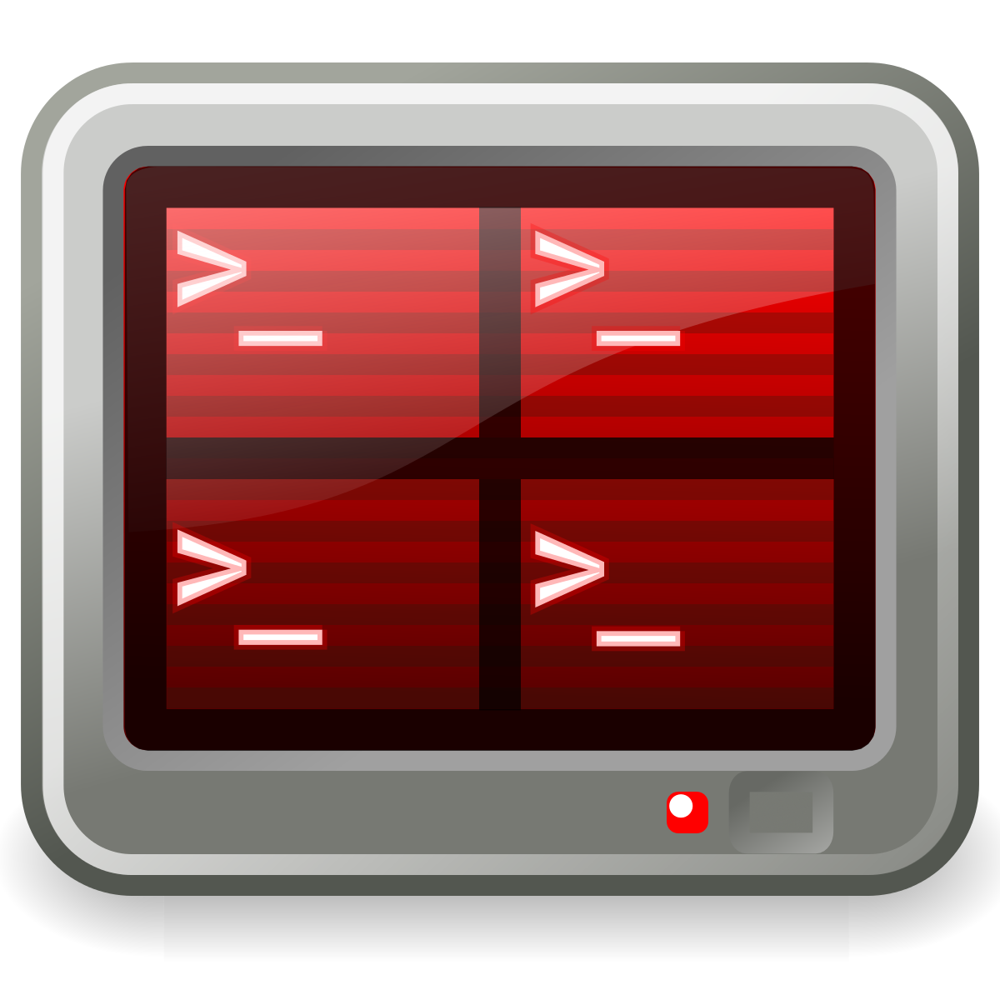

# ros2_basic
Learning ROS2 basics for beginners

# ROS2 installation
The version used in this project is ROS2 Humble. The installation follows the instruction at the [ROS2 Humble installation](https://docs.ros.org/en/humble/Installation/Ubuntu-Install-Debians.html) home page.

## Note
This version is compatible with Ubuntu 22.04+.    
For Ubuntu 20.04, you should install ROS2 Foxy. The installation is pretty much the same as Humble.  
The older versions of Ubuntu will not be able to locate the package of ROS2. 


## Set locale
First run 
`locale` 
to check the locale supports UTF-8. If not, run the next 4 four lines:
```
sudo apt update && sudo apt install locales
sudo locale-gen en_US en_US.UTF-8
sudo update-locale LC_ALL=en_US.UTF-8 LANG=en_US.UTF-8
export LANG=en_US.UTF-8
```
## Setup Sources
You will need to add the ROS 2 apt repository to your system.  
First ensure that the [Ubuntu Universe repository](https://help.ubuntu.com/community/Repositories/Ubuntu) is enabled.    
```
sudo apt install software-properties-common
sudo add-apt-repository universe
```
Now add the ROS 2 GPG key with apt.  
```
sudo apt update && sudo apt install curl -y
sudo curl -sSL https://raw.githubusercontent.com/ros/rosdistro/master/ros.key -o /usr/share/keyrings/ros-archive-keyring.gpg
```
Then add the repository to your sources list.
```
echo "deb [arch=$(dpkg --print-architecture) signed-by=/usr/share/keyrings/ros-archive-keyring.gpg] http://packages.ros.org/ros2/ubuntu $(. /etc/os-release && echo $UBUNTU_CODENAME) main" | sudo tee /etc/apt/sources.list.d/ros2.list > /dev/null
```

## Install ROS 2 packages
Update your apt repository caches after setting up the repositories.
```
sudo apt update
```
Then you need to upgrade
```
sudo apt upgrade
```
ROS2 is a collection of packages. It is recommended to install full desktop version instead of barebone version
```
sudo apt install ros-humble-desktop
```
### Source the bash file
If you open a new terminal and type in `ros2` command, this will not be found. To make this happen, you need to source the `setup.bash` file which is located at the folder `/opt/ros/humble`(or `foxy` depend on the Ubuntu version).  
First open the `.bashrc` using an editor(here I use gedit).
```
cd
gedit .bashrc
``` 
Then add at the end of file this line
```
source /opt/ros/humble/setup.bash
``` 

# Basic programming tools go with ROS2
## Terminator/Tmux(optional)
To install
```
sudo apt install terminator
```
or 
```
sudo apt install tmux
```
<!--  -->


## Visual Studio Code(recommmended)
A very powerful and 'humble' IDE that is recommended to be used.  
Some basic extensions to install in VSCode: 
1. cmake
1. C/C++
1. Python

## Necessary Tools
pip:
```
sudo apt install python3-pip
```
### ROS2 build tool: Colcon
To install:
```
sudo apt install python3-colcon-common-extensions
```
Now, the `colcon` is installed in the folder `/usr/share/`.  
You will need to source the `colcon_argcomplete.bash` file in the folder `/usr/share/colcon_argcomplete/hook` for autocompletion.  
First open the `.bashrc` using an editor(here I use gedit).
```
cd
gedit .bashrc
``` 
Then add at the end of file this line
```
source /usr/share/colcon_argcomplete/hook/colcon_argcomplete.bash
```
So from now on, everytime you call the function colcon, the system will recognize it and you can have autocompletion functionality.