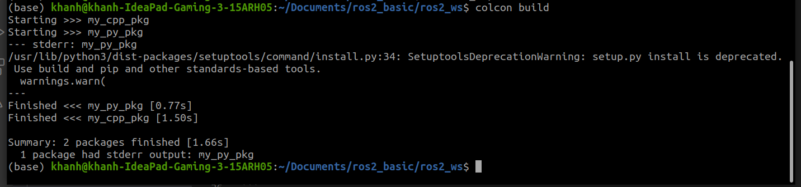
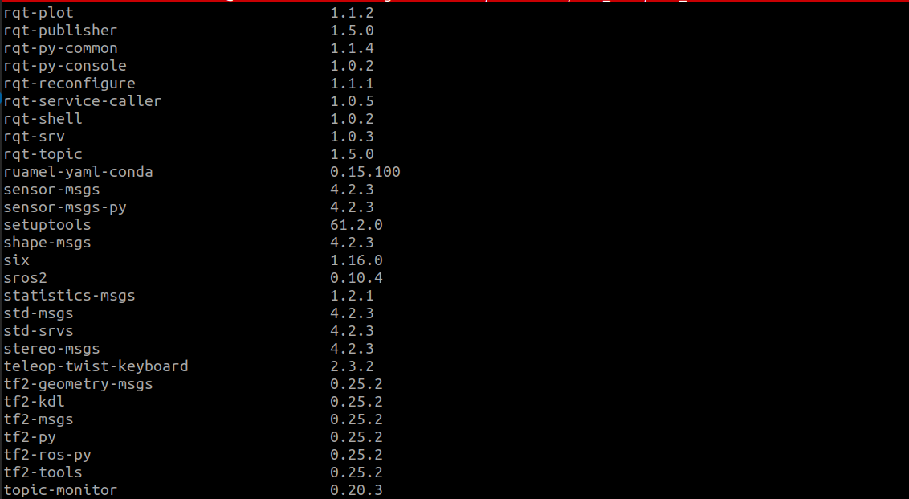
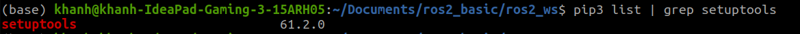

# Create ROS2 workspace
Usually, we create a folder as the workspace of ROS2 with name `ros2_ws`.
```
mkdir ros2_ws
```
We create a `src` folder inside the `ros2_ws` to store all the packages we write in the future.
```
cd ros2_ws
mkdir src
```
For the first time, run `colcon build`. This will generate some folders `build`, `install` and `log` in the workspace.  

Imagine when we created a program in our workspace and we want to run this anywhere that we want.  
In this case, we need to source the `local_setup.bash` or `setup.bash` file in the `install` folder so that it can be located.  
Open the `.bashrc` file:
```
cd
gedit /bashrc
```
and then source the `setup.bash` file by adding a newline
```
source PATH_TO_YOUR_WORKSPACE/ros2_ws/install/setup.bash
```

# Create a package
To create a package, first go to `src` folder where we will write our package.
```
cd ros2_ws/src
```
Then, using the `ros2 pkg create` to create the package.  
If you want to create a `Python` package:
```
ros2 pkg create package_name --build-type ament_python --dependencies rclpy
```
If you want to create a `C++` package:
```
ros2 pkg create package_name --build-type ament_cmake --dependencies rclcpp
```

# Install package
Either use
```
colcon build
```
to build/rebuild all the packages. Or we can specify the package to install:
```
colcon build --packages-select my_package_name
```
## Dynamic install
As we debug our code, we don't want to reinstall again the package from the beginning. To save time, we add `--symlink-install` option to dynamically install the change that we make.
```
colcon build --packages-select my_package_name --symlink-install
```
## Notes on deprecation of the pip setup tool:
As we build the program, maybe you will see this warning message:
  

To solve this problem, we need to get the correct version of the pipsetuptools.  
First, we need to see the version of the package using terminal:
```
pip3 list
```

Or we can pass the result to search for the `setuptools`
```
pip3 list | grep setuptools
```

As we can see, the version installed is `61.2.0`.  
Now, we need to downgrade the version to the correct one which is `58.2.0` by reinstalling it:
```
pip install setuptools==58.2.0
```
If the warning message does not go away, this is nothing to worry as it is just a warning.   
Recent version of ROS2 has some updates that cause this problem but it will, for sure, disappear in the future.

